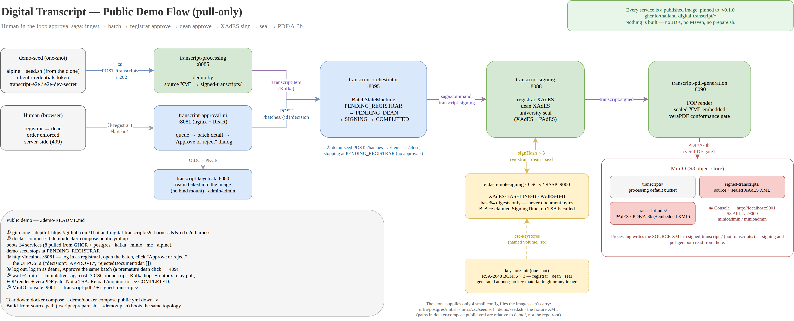
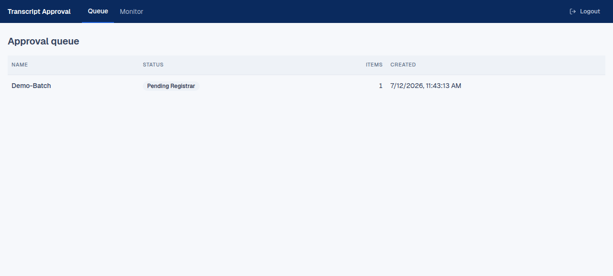
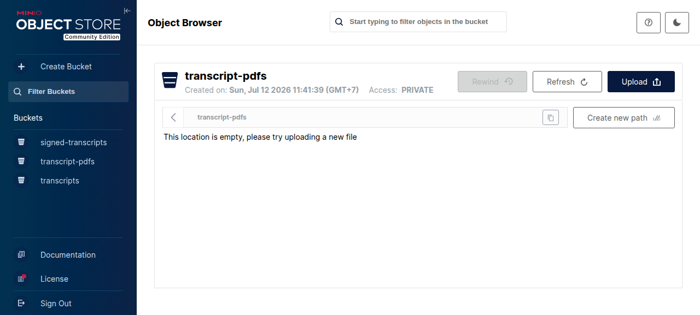
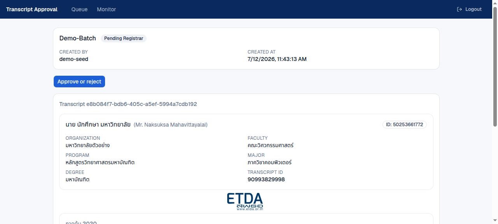
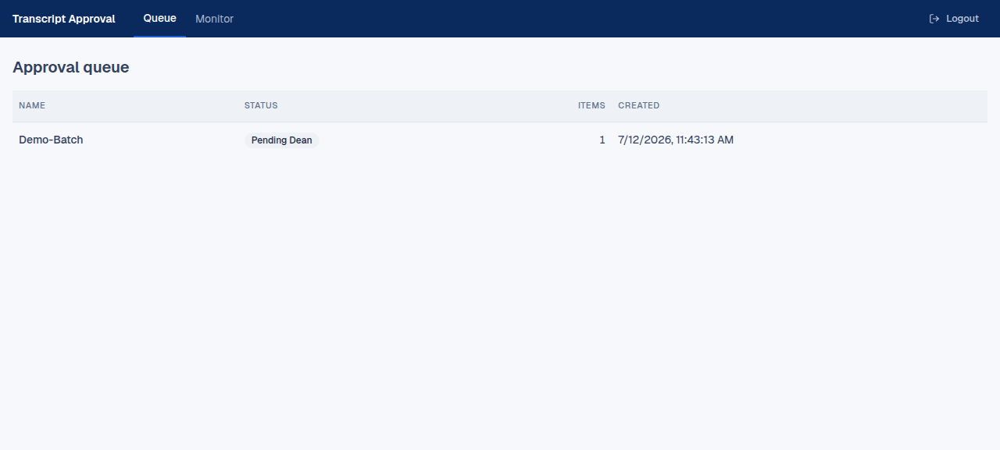
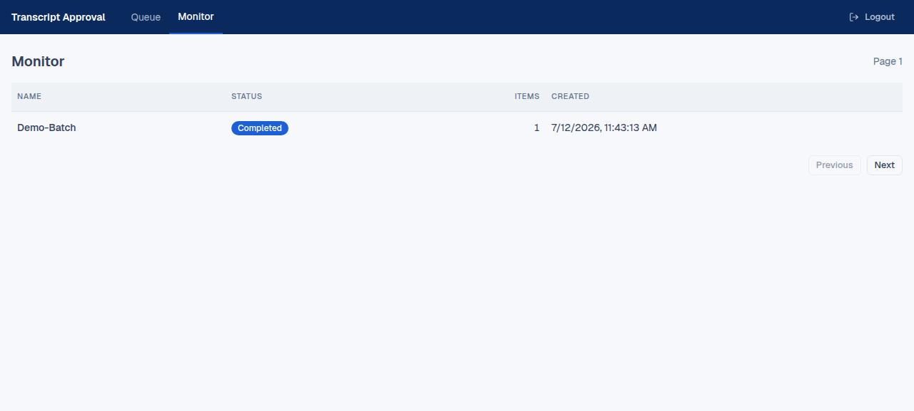
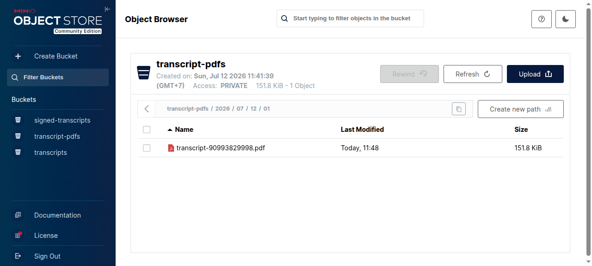
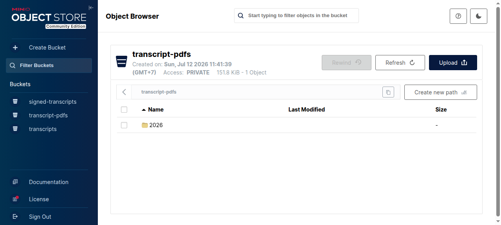
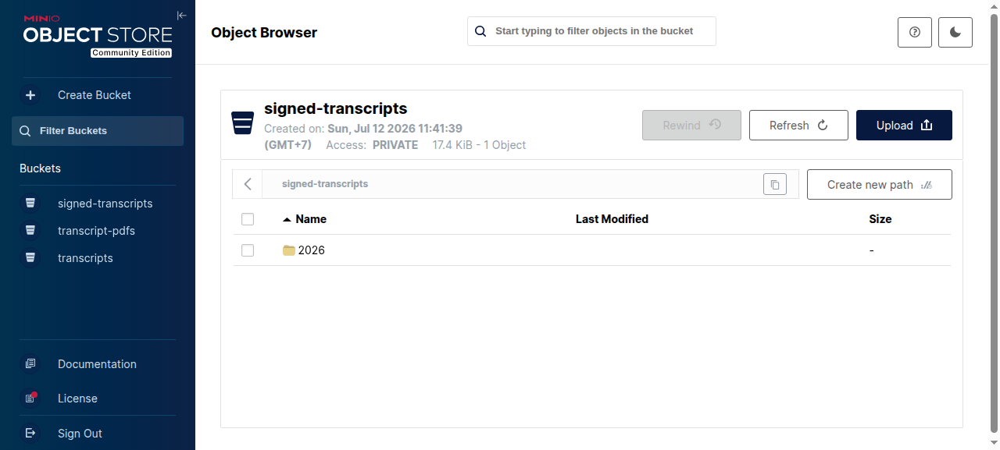
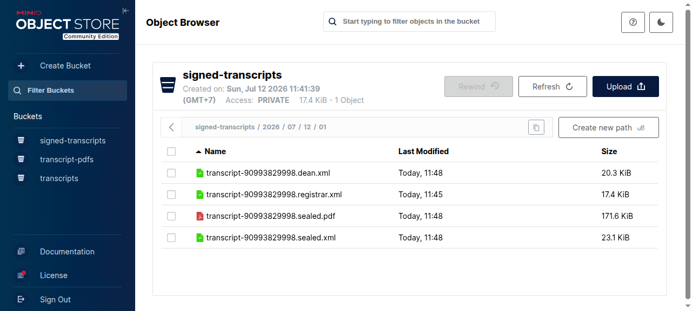

# Interactive Demo — Transcript Platform

Boot the whole digital-transcript platform locally, with a transcript already
waiting in the approval queue, and walk it through registrar → dean approval to a
completed signed PDF/A-3b — all in the browser.



*Source: [`demo-flow.drawio`](demo-flow.drawio) — edit at [diagrams.net](https://app.diagrams.net), then
re-export with `drawio -x -f png -s 2 --no-sandbox -o demo-flow.png demo-flow.drawio`. Keep
`--no-sandbox`: without it the CLI exits `0` and silently writes no file on headless/containerised
hosts.*

> **Dev-only sandbox.** The realm, the `e2e-dev-secret` client secret, the demo
> user passwords, and `minioadmin` / `admin` are known throwaway values. Never
> reuse them outside a local sandbox.

## Prerequisites

**Public quick start (no build tools):** Docker with the Compose **v2** plugin. Nothing else —
`docker-compose.public.yml` is standalone and pulls every image.

**Building from source:**
- Docker with the Compose **v2.20+** plugin.
- JDK 21 + Maven, needed once to build the service JARs.
- Host `curl` + `jq`, used by `./demo/smoke.sh`.
- The sibling service repos checked out alongside `e2e-harness/`:
  `transcript-processing/`, `transcript-orchestrator/`, `transcript-signing/`,
  `transcript-pdf-generation/`, `transcript-approval-ui/`, and
  `etax/eidasremotesigning/`. See the repo `README.md` for the workspace layout.

## Quick start

```bash
# 1. One-time: build service JARs, signing keystores, and the Keycloak realm.
./scripts/prepare.sh

# 2. Boot the stack and seed a batch into the approval queue.
./demo/up.sh
```

`./demo/up.sh` builds the images, starts the 13-container demo stack (the 12-service
base + a one-shot `demo-seed`), and blocks until the seed job has placed one batch
at `PENDING_REGISTRAR`. On a cold start this takes several minutes (Keycloak realm
import + five Spring Boot JVMs; the approval UI is an nginx image, not a JVM).

## Quick start — no build tools

If you don't want to install JDK/Maven or check out six sibling repos, run the demo entirely
from published images instead:

```bash
git clone --depth 1 https://github.com/Thailand-digital-transcript/e2e-harness
cd e2e-harness
docker compose -f demo/docker-compose.public.yml up
```

Every service is a pinned `:v0.1.0` image pulled from GHCR — nothing is built, so this skips
`./scripts/prepare.sh` entirely. The clone supplies four small config files the images can't
carry (Postgres init, the CSC seed SQL, the seed script, and the fixture XML) — see
"How it works" below. Everything past this point in the walkthrough is identical either way.

Tear down with:

```bash
docker compose -f demo/docker-compose.public.yml down -v
```

> **Four workflows coexist cleanly.** The base `docker-compose.yml` is
> intentionally port-less so `mvn verify` can run without host-port conflicts.
> `./scripts/dev-up.sh` layers `docker-compose.dev.yml` for the manual UI
> workflow; `./demo/up.sh` layers `demo/docker-compose.demo.yml` to add the
> `demo-seed` job and the Keycloak/UI/orchestrator/MinIO ports. `mvn verify`
> boots its **own** Testcontainers-managed stack from the port-less base file,
> so it binds no host ports and can run alongside a manual dev stack (it does
> not test *against* that stack). `demo/docker-compose.public.yml` is a
> **fourth, standalone** path — it is not layered on `docker-compose.yml` at
> all, since nothing in it is built from source. **Do not** run
> `./demo/up.sh` and `./scripts/dev-up.sh` at the same time — they both bind
> `8080`, `8081`, and `8095` and would collide. `docker-compose.public.yml`
> binds the same three ports, so don't run it alongside either of those two
> either. Tear the demo down with `./demo/down.sh` (or
> `docker compose -f demo/docker-compose.public.yml down -v` for the public
> path) first.

## Walkthrough

1. Open the **Approval UI** at <http://localhost:8081> and log in as **`registrar1`**
   (realm `transcript`). The seeded batch is in the queue — click its row to open the
   batch detail page, click **Approve or reject**, leave the dialog on **APPROVE**,
   and submit. The UI sends `{"decision":"APPROVE","rejectedDocumentIds":[]}` to the
   role-gated `POST /api/v1/batches/{id}/decision` (whole-batch decisions carry an
   empty rejection set, and the `rejectionReason` key is omitted entirely).
2. Log out, log in as **`dean1`**, and approve the same batch the same way (it is now
   at `PENDING_DEAN`). The order is enforced server-side — a premature dean click
   returns a `409`, which the UI surfaces as a *"This batch has already moved on"*
   toast.
3. **Wait a few minutes.** After the dean approval the saga runs signing (XAdES) →
   seal (XAdES + PAdES) → PDF generation. The transition to `COMPLETED` can take up
   to ~2 minutes — not because of a timestamp authority (signing is B-B, no TSA) but
   from cumulative saga cost: several CSC remote-signing round-trips, Kafka hops plus
   the outbox relay poll interval, and the PDF/A-3b render + veraPDF gate. The batch
   is **not** stalled. Note that **nothing auto-refreshes into `COMPLETED`**: the
   batch detail page polls only while the batch sits at an approver gate, then
   redirects you back to `/queue`, and neither `/queue` nor `/monitor` polls. Reload
   `/monitor` (or re-run `./demo/smoke.sh`-style API calls) to watch it land.
4. **Inspect the artifacts** in the **MinIO console** at <http://localhost:9001>
   (`minioadmin` / `minioadmin`): bucket `transcripts` holds the original ingested
   XML; `signed-transcripts` holds every signed/sealed XML (registrar, dean, sealed)
   plus the final PAdES-signed PDF; `transcript-pdfs` holds the rendered PDF/A-3b
   before PAdES signing. Every key follows
   `<yyyy>/<MM>/<dd>/<typeCode>/transcript-<id>[.suffix].{xml,pdf}` — no UUIDs, no
   batch- or document-id folders, anywhere.
5. **Poke Keycloak** admin at <http://localhost:8080> (`admin` / `admin`) to see the
   realm, users, roles, and the `transcript-e2e` client.

## What it looks like

Captured from a real run of the walkthrough above — logging in through Keycloak and clicking
through the approval dialog, not driving the API directly.

Current target key layout, once a batch completes (six keys across three buckets — see
the plan's Global Constraints for the authoritative table):

| Artifact | Bucket | Key |
|---|---|---|
| original | `transcripts` | `2026/07/10/01/transcript-90993829998.xml` |
| registrar-signed | `signed-transcripts` | `2026/07/10/01/transcript-90993829998.registrar.xml` |
| dean-signed | `signed-transcripts` | `2026/07/10/01/transcript-90993829998.dean.xml` |
| sealed | `signed-transcripts` | `2026/07/10/01/transcript-90993829998.sealed.xml` |
| rendered PDF | `transcript-pdfs` | `2026/07/10/01/transcript-90993829998.pdf` |
| PAdES-signed PDF | `signed-transcripts` | `2026/07/10/01/transcript-90993829998.sealed.pdf` |

No key anywhere contains a UUID, a batch id, or a document id — the prefix is purely the
ingest date (`yyyy/MM/dd`) plus the transcript's own type code.

### Before either approval

The seeded batch waits at `PENDING_REGISTRAR`, and `transcript-pdfs` is empty — nothing has
been signed or rendered yet.

| Approval UI — registrar's queue | MinIO — `transcript-pdfs` |
|---|---|
|  |  |

`transcripts` is **already non-empty** at this point — exactly one object, under a
`yyyy/MM/dd/typeCode/` prefix. That's the *original* XML, which `transcript-processing`
uploaded at ingest, long before anyone approved anything.

The batch detail page is where the decision is made — note the button is **Approve or reject**,
which opens a dialog whose submit button reads *Submit decision*:



### After the registrar approves

The registrar's XAdES signature is applied — landing at
`<date>/<typeCode>/transcript-<id>.registrar.xml` in `signed-transcripts` — and the batch
advances to the dean's gate. It now appears in `dean1`'s queue as `PENDING_DEAN`:



### After the dean approves

The saga applies the dean's XAdES signature, seals the document, renders the PDF/A-3b, then
PAdES-signs it. `/monitor` shows `COMPLETED` (reload it — it does not auto-refresh), and all
three buckets now hold their artifacts per the key table above: `transcript-pdfs` holds the
one rendered (pre-PAdES) PDF, and `signed-transcripts` holds four objects — the registrar-,
dean-, and sealed-XML, plus the final `.sealed.pdf`.

| Approval UI — `/monitor` | MinIO — the generated PDF/A-3b |
|---|---|
|  |  |

Every object sits directly under its `yyyy/MM/dd/typeCode/` date prefix — no batch-id or
document-id folder to click through — so `mc ls --recursive <bucket>` (or the console) shows
the full key on one line:

| MinIO — `transcript-pdfs` root | MinIO — `signed-transcripts` root |
|---|---|
|  |  |



## Ingest your own transcript

```bash
./demo/ingest.sh path/to/YourTranscript.xml
```

This opens and closes a fresh batch for a transcript with a **new**
`<tc:TranscriptID>`, leaving it at `PENDING_REGISTRAR` for you to approve.

**De-duplication:** `transcript-processing` keys each transcript by its
`<tc:TranscriptID>`. Ingesting a transcript whose `TranscriptID` already exists is
reported as a no-op (`already ingested … nothing to do`) and does **not** create a
second batch. To seed another batch, ingest a transcript with a **distinct**
`TranscriptID`. (Running `./demo/ingest.sh` with no argument re-submits the bundled
fixture, which is already in the queue after first boot — so it's a deliberate
no-op.) `./demo/down.sh` clears everything for a fresh start.

**Institution:** the batch is always created under institution **`01110`** (the
demo's fixed institution), regardless of the XML's own institution, so it stays
visible to `registrar1` / `dean1`.

## Verify / tear down

```bash
./demo/smoke.sh   # asserts at least one batch is PENDING_REGISTRAR
./demo/down.sh    # stop the stack and remove volumes
```

## Troubleshooting

**Realm edits require a `down -v` to take effect.** Keycloak runs `start-dev
--import-realm`, which imports `infra/keycloak/realm-export.json` **only on a
fresh boot** — when the realm doesn't already exist in its embedded H2 DB. If you
edit the realm file (or re-run `./scripts/prepare.sh` / `sync-realm.sh`) while the
stack is up, a plain restart will **not** re-import: `--import-realm` sees the
realm already present and skips it, so the container keeps running the stale
config. The `:ro` bind mount makes the in-container file *look* updated, which is
misleading — the running realm in H2 is what counts.

Symptom seen in practice: logging out from <http://localhost:8081/queue> returns
**"Invalid redirect uri"** because the live `transcript-approval-ui` client is
missing `http://localhost:8081/queue` in its `post.logout.redirect.uris`, even
though the on-disk realm file lists it.

Fix — force a clean re-import:

```bash
./demo/down.sh   # removes containers + volumes (wipes the stale H2 realm DB)
./demo/up.sh     # fresh boot re-imports the corrected realm
```

`-v` also wipes Postgres and MinIO, so re-seed afterward (`./demo/up.sh` already
runs `demo-seed`; use `./demo/ingest.sh` for additional batches).

## Endpoints & credentials

| Surface | URL | Credentials |
|---------|-----|-------------|
| Approval UI | <http://localhost:8081> | `registrar1` / `dean1` (realm `transcript`) |
| Keycloak admin | <http://localhost:8080> | `admin` / `admin` |
| MinIO console | <http://localhost:9001> | `minioadmin` / `minioadmin` |
| Orchestrator API | <http://localhost:8095/api/v1/batches> | bearer (client `transcript-e2e`, secret `e2e-dev-secret`) |

## How it works

The repo has three compose paths that share one base topology. The base
`docker-compose.yml` is intentionally port-less — services expose container
ports only — so any of the following can boot without host-port collisions
between each other:

| Workflow | Command | What it adds |
|----------|---------|--------------|
| Integration test | `mvn verify` | Testcontainers-managed stack on its own ambassador network |
| Manual dev | `./scripts/dev-up.sh` | `docker-compose.dev.yml` overlay → host port bindings (8080/8081/8085/8088/8090/8095) |
| Demo (from source) | `./demo/up.sh` | `demo/docker-compose.demo.yml` overlay → Keycloak (8080), approval UI (8081), orchestrator API (8095), MinIO S3 + console (9000/9001), and the one-shot `demo-seed` container |
| Demo (published images) | `docker compose -f demo/docker-compose.public.yml up` | standalone — the full topology, every service a pinned `:v0.1.0` GHCR image, no `build:` anywhere |

`demo/docker-compose.demo.yml` only adds what the demo needs beyond the base:
host bindings for Keycloak (8080) and the approval UI (8081) so the walkthrough
is reachable from a browser, the orchestrator REST port (8095) for `smoke.sh`
and batch inspection, MinIO's S3 API (9000) and console (9001) so users can
browse the generated PDF/A-3b and sealed XML, and the one-shot `demo-seed`
container. The 12-service topology is otherwise inherited from the base file —
the overlay changes nothing but ports. `demo-seed` runs
`demo/seed.sh`, which ingests the transcript, mints a `transcript-e2e`
client-credentials token, and opens + closes a batch — stopping at
`PENDING_REGISTRAR` so the approvals are left for you. All wrappers run
`docker compose -f docker-compose.yml -f demo/docker-compose.demo.yml` from
the repo root.

`demo/docker-compose.public.yml` is not layered on `docker-compose.yml` — it's a complete,
self-contained topology using published images. `keystore-init` (a one-shot container) and
`transcript-keycloak` (Keycloak with the realm baked in) replace the bind-mounted keystores
and realm file respectively; the four remaining bind mounts (`infra/postgres/init.sh`,
`infra/csc/seed.sql`, `demo/seed.sh`, and the fixture XML) are small enough that a shallow
clone supplying them beats publishing three more images just to eliminate a `git clone`.
